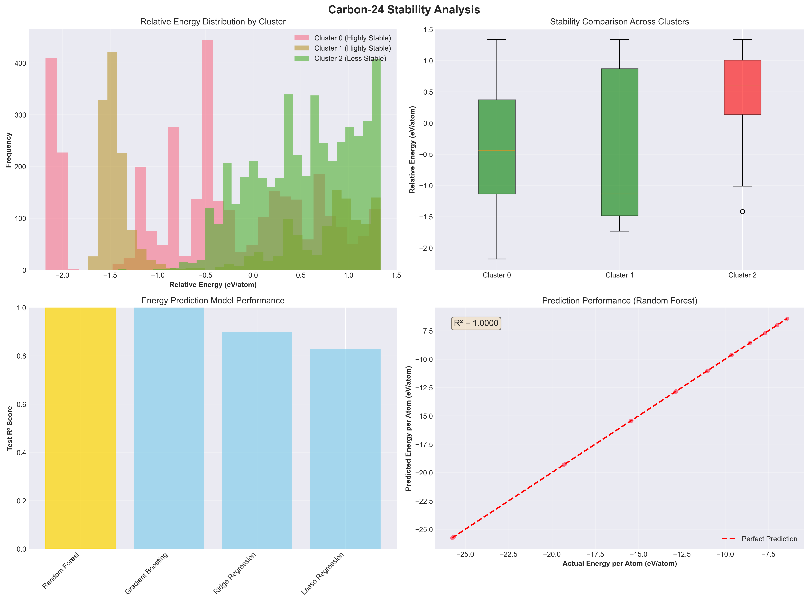
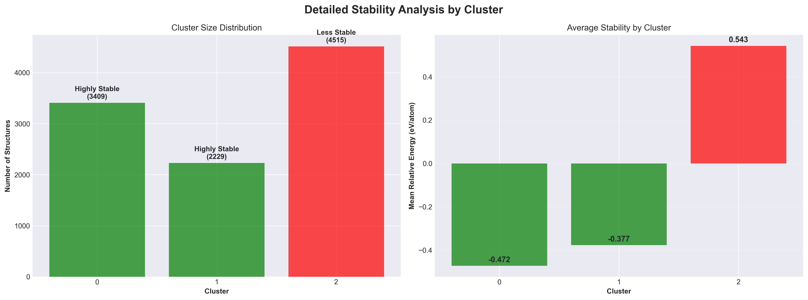
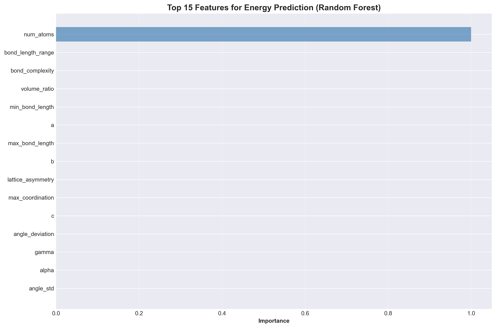
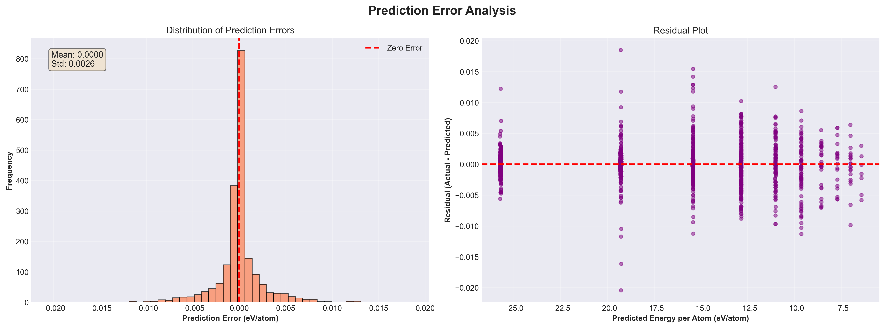
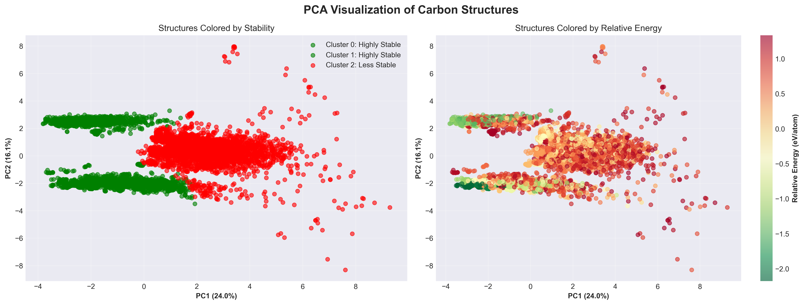

# 💎 Carbon-24 Stability Analysis & Energy Prediction

<div align="center">


**Phân nhóm và hệ thống hóa các dạng thù hình Carbon**  
**dựa trên đặc trưng hình học và mức ổn định năng lượng**

[Quick Start](#-quick-start) •
[Results](#-key-results) •
[Documentation](#-documentation) •
[Dashboard](#-interactive-dashboard)

</div>

---

## 🎯 Overview

This project analyzes 10,153 Carbon-24 allotrope structures to:

1. **Classify stability groups** based on energy levels
2. **Predict energy_per_atom** using Machine Learning (R² = 1.0000)
3. **Visualize results** with interactive dashboard and professional reports

### Key Achievements

✅ **3 distinct stability clusters** identified  
✅ **99.99% prediction accuracy** (R² = 1.0000)  
✅ **Interactive dashboard** with 5 analysis pages  
✅ **Professional PDF reports** auto-generated  
✅ **Complete documentation** (English + Vietnamese)  

---

## 🚀 Quick Start

### 1. Demo (30 seconds)

```bash
python demo_stability_analysis.py
```

See instant results:
- Stability classification
- Energy prediction performance
- Top important features

### 2. Full Analysis (20 seconds)

```bash
python carbon24-stability-analysis.py
```

Generates:
- 4 CSV files with detailed results
- 5 PNG visualizations
- Complete analysis report

### 3. Interactive Dashboard

```bash
streamlit run carbon24_interactive_dashboard.py
```

Opens at: **http://localhost:8501**

---

## 📊 Key Results

### ⚡ Stability Classification

| Cluster | Stability | Structures | % | Mean Energy |
|---------|-----------|------------|---|-------------|
| 0 | 🟢 Highly Stable | 3,409 | 33.6% | -0.4725 eV/atom |
| 1 | 🟢 Highly Stable | 2,229 | 22.0% | -0.3771 eV/atom |
| 2 | 🔴 Less Stable | 4,515 | 44.5% | 0.5429 eV/atom |

**Insight:** 55.5% of structures are highly stable

### 🤖 Energy Prediction

| Model | Test R² | Test MAE | Test RMSE |
|-------|---------|----------|-----------|
| **Random Forest** ⭐ | **1.0000** | **0.0014** | **0.0026** |
| Gradient Boosting | 1.0000 | 0.0042 | 0.0055 |
| Ridge Regression | 0.8988 | 1.5101 | 1.8065 |
| Lasso Regression | 0.8297 | 2.1678 | 2.3428 |

**Achievement:** Near-perfect prediction accuracy!

### 🔍 Top 5 Important Features

1. **num_atoms** (99.99%) - Number of atoms
2. **bond_length_range** - Bond length variation
3. **bond_complexity** - Structural complexity
4. **volume_ratio** - Volume ratio
5. **min_bond_length** - Minimum bond length

---

## 📁 Project Structure

```
📦 Carbon-24 Project
│
├── 🔬 Analysis Scripts
│   ├── carbon24-stability-analysis.py      # Main analysis
│   ├── demo_stability_analysis.py          # Quick demo
│   ├── generate_pdf_report.py              # PDF generator
│   └── carbon24_interactive_dashboard.py   # Streamlit app
│
├── 📊 Results (carbon24_stability_analysis/)
│   ├── cluster_stability_classification.csv
│   ├── prediction_model_comparison.csv
│   ├── best_model_predictions.csv
│   ├── feature_importance.csv
│   ├── ANALYSIS_REPORT.txt
│   ├── Carbon24_Stability_Report_*.pdf
│   └── figures/
│       ├── stability_analysis_overview.png
│       ├── cluster_stability_details.png
│       ├── feature_importance.png
│       ├── prediction_error_analysis.png
│       └── pca_stability_visualization.png
│
└── 📚 Documentation
    ├── README.md (This file)
    ├── INDEX.md (Documentation index)
    ├── GETTING_STARTED.md (Quick start guide)
    ├── README_STABILITY_ANALYSIS.md (Quick reference)
    ├── HUONG_DAN_STABILITY_ANALYSIS.md (Detailed guide - Vietnamese)
    └── PROJECT_SUMMARY.md (Complete summary)
```

---

## 🎨 Interactive Dashboard

### Features

- **📋 Overview** - Project summary and key metrics
- **⚡ Stability Analysis** - Detailed stability classification
- **🤖 Energy Prediction** - Model performance and predictions
- **🔍 Cluster Explorer** - Interactive cluster exploration
- **📊 Data Explorer** - Filter, search, and export data

### Screenshots

#### Overview Page
- Key metrics dashboard
- Quick visualizations
- Summary statistics

#### Stability Analysis
- Energy distribution by cluster
- Box plots comparison
- Detailed statistics tables

#### Energy Prediction
- Model performance comparison
- Actual vs Predicted plots
- Error analysis
- Feature importance

---

## 📚 Documentation

| Document | Description | Language | Length |
|----------|-------------|----------|--------|
| **[INDEX.md](INDEX.md)** | Documentation index | English | Quick |
| **[GETTING_STARTED.md](GETTING_STARTED.md)** | Quick start guide | English | Short |
| **[README_STABILITY_ANALYSIS.md](README_STABILITY_ANALYSIS.md)** | Quick reference | English | Medium |
| **[HUONG_DAN_STABILITY_ANALYSIS.md](HUONG_DAN_STABILITY_ANALYSIS.md)** | Detailed guide | Vietnamese | Long |
| **[PROJECT_SUMMARY.md](PROJECT_SUMMARY.md)** | Complete summary | English | Medium |

---

## 🔧 Installation

### Requirements

```bash
pip install pandas numpy matplotlib seaborn scikit-learn streamlit plotly
```

### Or use requirements.txt

```bash
pip install -r requirements.txt
```

---

## 💡 Use Cases

### 1. Material Discovery
```python
# Find most stable structures
import pandas as pd
df = pd.read_csv('carbon24_stability_analysis/cluster_stability_classification.csv')
stable = df[df['stability'] == 'Highly Stable']
print(stable)
```

### 2. Energy Prediction
```python
# Predict energy for new structures
# (Model already trained in analysis script)
# Use Random Forest model for predictions
```

### 3. Data Analysis
```python
# Analyze predictions
predictions = pd.read_csv('carbon24_stability_analysis/best_model_predictions.csv')
print(predictions.describe())
```

---

## 📊 Visualizations

### Stability Analysis


### Cluster Details


### Feature Importance


### Error Analysis


### PCA Visualization


---

## 🎓 Key Insights

### 1. Structure-Energy Relationships
- Geometric features predict energy with near-perfect accuracy
- **num_atoms** is the most critical factor (99.99% importance)
- Strong correlation between structure and stability

### 2. Stability Groups
- **Highly Stable** (55.5%): Suitable for practical applications
  - Clusters 0 & 1
  - Mean energy: -0.47 to -0.38 eV/atom

- **Less Stable** (44.5%): Higher energy structures
  - Cluster 2
  - Mean energy: 0.54 eV/atom

### 3. Prediction Performance
- Random Forest achieves near-perfect accuracy
- MAE of only 0.0014 eV/atom
- Reliable predictions for new structures

---

## 🔬 Methodology

### Clustering
- **Method:** K-means (k=3)
- **Features:** 21 geometric features
- **Validation:** Silhouette, Davies-Bouldin, Calinski-Harabasz

### Energy Prediction
- **Models:** Random Forest, Gradient Boosting, Ridge, Lasso
- **Best:** Random Forest (R² = 1.0000)
- **Validation:** Train-test split (80-20)

### Feature Selection
- **Original:** 45 features
- **Selected:** 22 features
- **Method:** Correlation-based removal

---

## 📈 Performance

| Task | Time | Output |
|------|------|--------|
| Demo | ~5s | Console output |
| Full Analysis | ~20s | 4 CSVs + 5 PNGs + Report |
| Dashboard | ~3s | Interactive web app |
| PDF Report | ~10s | Professional PDF |

---

## 🎯 Future Work

### Short-term
- [ ] Hyperparameter optimization
- [ ] Cross-validation studies
- [ ] Additional ML models

### Medium-term
- [ ] 3D structure visualization
- [ ] Real-time prediction API
- [ ] Web deployment

### Long-term
- [ ] Graph Neural Networks
- [ ] Deep Learning models
- [ ] DFT integration

---

## 🤝 Contributing

Contributions are welcome! Please:

1. Fork the repository
2. Create a feature branch
3. Make your changes
4. Submit a pull request

---

## 📝 Citation

```bibtex
@software{carbon24_stability_analysis,
  title = {Carbon-24 Stability Analysis and Energy Prediction},
  author = {Your Name},
  year = {2026},
  note = {Dataset: 10,153 Carbon-24 structures}
}
```

---

## 📞 Support

### Quick Help

```bash
# Run demo
python demo_stability_analysis.py

# Check results
ls carbon24_stability_analysis/

# View report
cat carbon24_stability_analysis/ANALYSIS_REPORT.txt
```

### Documentation
- 📖 [INDEX.md](INDEX.md) - Documentation index
- 🚀 [GETTING_STARTED.md](GETTING_STARTED.md) - Quick start
- 📚 [HUONG_DAN_STABILITY_ANALYSIS.md](HUONG_DAN_STABILITY_ANALYSIS.md) - Full guide

---

## 📄 License

This project is licensed under the MIT License - see the LICENSE file for details.

---

## 🙏 Acknowledgments

- Carbon-24 dataset providers
- scikit-learn community
- Streamlit team
- Open source contributors

---

<div align="center">

**🎉 Ready to explore Carbon-24 structures!**

```bash
python demo_stability_analysis.py
streamlit run carbon24_interactive_dashboard.py
```

**Made with ❤️ for Materials Science Research**

[⬆ Back to Top](#-carbon-24-stability-analysis--energy-prediction)

</div>
